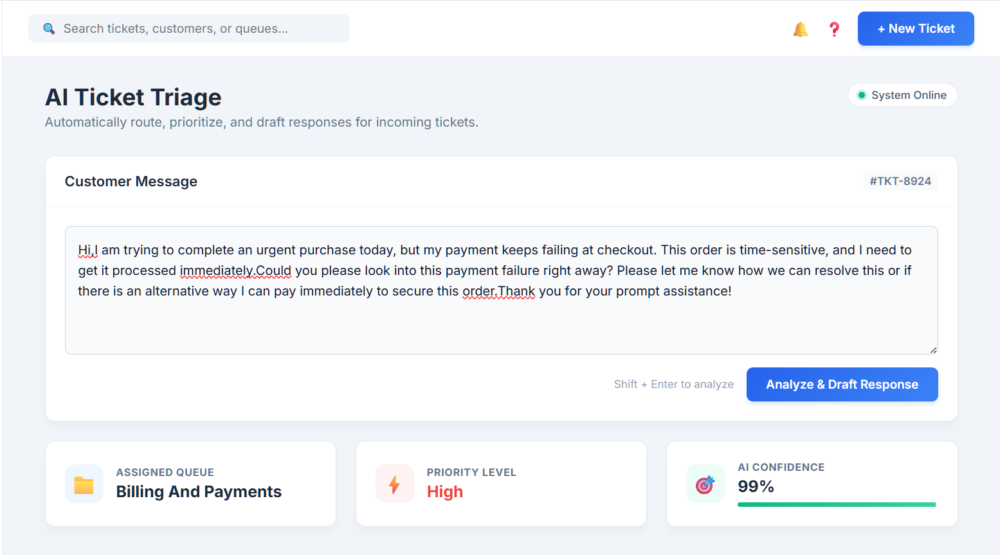
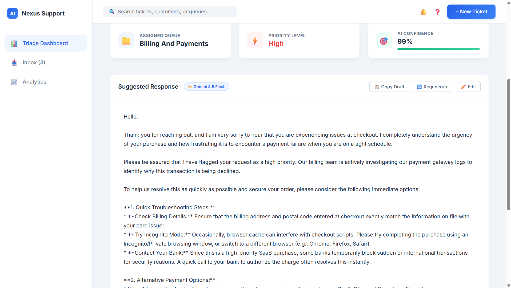

# 🎫 Enterprise AI Support Ticket Classifier & Response Generator

An intelligent customer support pipeline combining **NLP intent classification** (DistilBERT + LinearSVC) with **generative response drafting** (Gemini 3.5 Flash) wrapped in a modern dashboard interface.

---

## 📸 Demo & Screenshots






---

## 🏗️ Architecture

```
Customer Ticket ──► Classifier (DistilBERT + LinearSVC) ──► Queue, Priority, Confidence
                                                                     │
                                                                     ▼
Suggested Response ◄── Gemini 3.5 Flash ◄── Prompt Builder ──────────┘
```

---

## ⚡ Quickstart

```bash
# 1. Clone & enter directory
git clone https://github.com/I-try-to-code/NLP--customer-ticket-classfier.git
cd NLP--customer-ticket-classfier/customer-support-ai

# 2. Setup Virtual Environment
python -m venv .venv
.venv\Scripts\activate       # Windows
# source .venv/bin/activate  # Mac/Linux

# 3. Install requirements
pip install -r requirements.txt

# 4. Set your API Key in customer-support-ai/.env
# GEMINI_API_KEY=your_key_here

# 5. Launch FastAPI server
python -m uvicorn src.api.app:app --reload
```
Open **`http://127.0.0.1:8000`** in your browser.

---

## 🛠️ Tech Stack

- **Department Classifier**: Fine-tuned DistilBERT (PyTorch / HuggingFace)
- **Priority Classifier**: LinearSVC + TF-IDF (scikit-learn)
- **LLM Generator**: Google Gemini 3.5 Flash
- **API & Frontend**: FastAPI, Uvicorn, Vanilla HTML/CSS/JS
